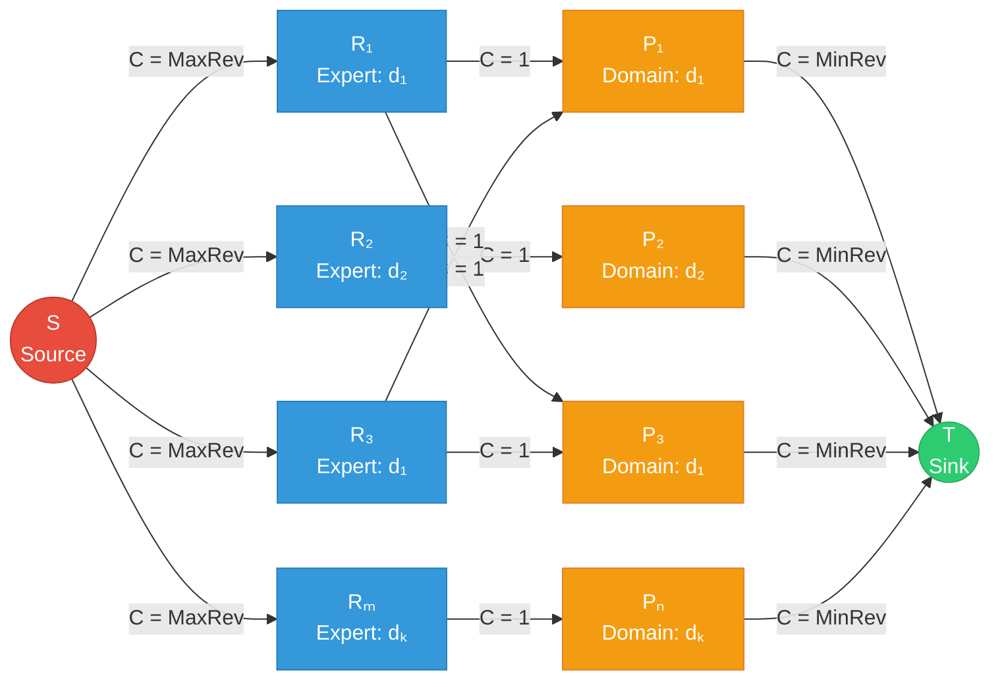
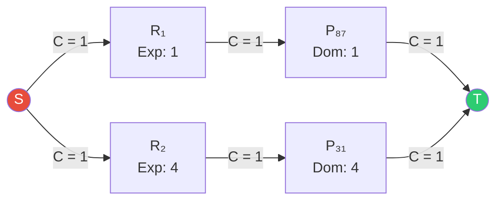

# T2.1 — Modelagem do Grafo para Atribuição Básica (Max-Flow)

## 1. Modelagem do Grafo (Formulação Completa)

### 1.1 Definição Formal do Problema

Dados:
- Conjunto de submissões $S = \{s_1, s_2, \dots, s_n\}$, cada uma com um domínio primário $d(s_i) \in \mathcal{D}$
  *(cada submissão contém também dados bibliográficos: **Título**, **Autores** e **E-mail** de contacto, conforme a especificação do projeto — estes campos são armazenados na struct `Submission` mas não afetam a modelagem do grafo)*
- Conjunto de revisores $R = \{r_1, r_2, \dots, r_m\}$, cada um com expertise primária $e(r_j) \in \mathcal{D}$
  *(cada revisor contém também **Nome** e **E-mail**, armazenados na struct `Reviewer` — igualmente sem influência na topologia do grafo)*
- Parâmetro $\text{MinRev}$ = número mínimo de revisões por submissão
- Parâmetro $\text{MaxRev}$ = número máximo de revisões por revisor

**Objetivo:** Encontrar uma atribuição que garanta que cada submissão receba *exatamente* $\text{MinRev}$ revisões (ou o máximo possível) e nenhum revisor exceda $\text{MaxRev}$ revisões, respeitando a compatibilidade de domínios.

**Restrição de compatibilidade (T2.1):** O revisor $r_j$ pode rever a submissão $s_i$ se e só se $e(r_j) = d(s_i)$ (apenas domínios primários).

---

### 1.2 Definição dos Nós

O grafo de fluxo $G = (V, E)$ é construído com **4 camadas**:

| Camada | Nós | Descrição |
|--------|-----|-----------|
| **Source** | $S$ (super-source) | Nó artificial que injeta fluxo na rede |
| **Camada 1** | $\{R_1, R_2, \dots, R_m\}$ | Um nó por cada revisor |
| **Camada 2** | $\{P_1, P_2, \dots, P_n\}$ | Um nó por cada submissão (paper) |
| **Sink** | $T$ (super-sink) | Nó artificial que absorve todo o fluxo |

**Total de nós:**

$$|V| = 2 + m + n$$

> **Nota sobre a direção do fluxo:** Optamos pela direção $S \to \text{Revisores} \to \text{Submissões} \to T$ porque:
> - As capacidades na saída do Source controlam o **limite superior por revisor** ($\text{MaxRev}$)
> - As capacidades na entrada do Sink controlam a **demanda por submissão** ($\text{MinRev}$)
> - As arestas intermédias codificam a **compatibilidade de domínio**

---

### 1.3 Definição das Arestas e Capacidades

#### Aresta Tipo 1: Source → Revisor

$$\forall r_j \in R: \quad (S, R_j) \text{ com } C(S, R_j) = \text{MaxRev}$$

**Justificação:** Cada revisor pode realizar *no máximo* $\text{MaxRev}$ revisões. A capacidade desta aresta limita fisicamente quanto fluxo (= quantas revisões) pode passar por este revisor. Se o fluxo saturar esta aresta, o revisor atingiu o seu limite.

#### Aresta Tipo 2: Revisor → Submissão (Compatibilidade)

$$\forall r_j \in R, \; \forall s_i \in S: \quad e(r_j) = d(s_i) \implies (R_j, P_i) \text{ com } C(R_j, P_i) = 1$$

**Justificação:** Capacidade unitária porque cada par (revisor, submissão) representa uma atribuição binária — ou o revisor revê essa submissão, ou não. Não faz sentido o mesmo revisor rever a mesma submissão mais do que uma vez. A aresta **só existe** se houver compatibilidade de domínio primário.

#### Aresta Tipo 3: Submissão → Sink

$$\forall s_i \in S: \quad (P_i, T) \text{ com } C(P_i, T) = \text{MinRev}$$

**Justificação:** Cada submissão precisa de *exatamente* $\text{MinRev}$ revisões. A capacidade desta aresta atua como um "funil" — mesmo que existam 10 revisores compatíveis com uma submissão, o fluxo que chega ao Sink por este nó nunca excederá $\text{MinRev}$. Isto garante que o fluxo máximo não "desperdiça" revisões em submissões que já têm revisores suficientes.

---

### 1.4 Cardinalidade das Arestas

$$|E| = m + n + |\{(r_j, s_i) : e(r_j) = d(s_i)\}|$$

Definindo $E_{\text{match}}$ como o número de pares compatíveis:

$$|E| = m + n + E_{\text{match}}$$

No **pior caso** (todos os revisores são compatíveis com todas as submissões, ou seja, um único domínio): $E_{\text{match}} = m \times n$, logo $|E| = O(m \cdot n)$.

---

### 1.5 Diagrama do Grafo (Mermaid)



### 1.6 Exemplo Concreto (da Figura 1 do Enunciado)

Considere o input de exemplo do enunciado com:
- Submissões: $s_{31}$ (domínio 4), $s_{87}$ (domínio 1)
- Revisores: $r_1$ (expertise 1), $r_2$ (expertise 4)
- `MinReviewsPerSubmission = 1`, `MaxReviewsPerReviewer = 1`



**Fluxo máximo esperado:** $|f^*| = 2 = n \times \text{MinRev}$ → atribuição **completa** (viável).

---

## 2. Intuição Lógica

### 2.1 Porque o Max-Flow resolve este problema

O problema de atribuição de revisores é uma generalização do **Maximal Bipartite Matching** com demandas nos dois lados:

1. **Upper-bound nos revisores** → controlado pelas capacidades $C(S, R_j) = \text{MaxRev}$
2. **Demanda nas submissões** → controlado pelas capacidades $C(P_i, T) = \text{MinRev}$
3. **Compatibilidade** → modelada pela existência (ou não) de arestas $R_j \to P_i$

Ao calcular o fluxo máximo $|f^*|$:
- Cada unidade de fluxo no caminho $S \to R_j \to P_i \to T$ representa **uma atribuição** do revisor $r_j$ à submissão $s_i$
- Se $|f^*| = n \times \text{MinRev}$, **todas as submissões** recebem o número mínimo de revisões → **atribuição viável**
- Se $|f^*| < n \times \text{MinRev}$, existem submissões sub-revistas → **atribuição inviável** (parcial)

### 2.2 Critério de Viabilidade

$$\text{Atribuição completa} \iff |f^*| = \sum_{i=1}^{n} \text{MinRev} = n \times \text{MinRev}$$

### 2.3 Condição Necessária (Sanity Check)

Antes de correr o Max-Flow, podemos verificar uma condição necessária (mas não suficiente):

$$\sum_{j=1}^{m} \text{MaxRev} \geq n \times \text{MinRev} \quad \Longleftrightarrow \quad m \times \text{MaxRev} \geq n \times \text{MinRev}$$

Se esta condição falhar, a atribuição é **impossível a priori** — a capacidade total dos revisores é insuficiente.

### 2.4 Extração da Atribuição a partir do Fluxo

Após o Edmonds-Karp terminar, iteramos sobre todas as arestas $R_j \to P_i$:

$$\text{Se } f(R_j, P_i) = 1 \implies \text{atribuir } r_j \text{ a } s_i \text{ com match no domínio } d(s_i)$$

---

## 3. Análise de Complexidade Rigorosa

### 3.1 Escolha do Algoritmo: Edmonds-Karp (BFS-based Ford-Fulkerson)

O algoritmo de Edmonds-Karp garante complexidade polinomial independente do valor do fluxo máximo.

### 3.2 Complexidade Temporal

O Edmonds-Karp tem complexidade:

$$T_{\text{EK}} = O(|V| \cdot |E|^2)$$

Com os nossos parâmetros:
- $|V| = 2 + m + n$
- $|E| = m + n + E_{\text{match}}$

No pior caso ($E_{\text{match}} = m \cdot n$):

$$T = O\bigl((m + n) \cdot (m \cdot n)^2\bigr) = O\bigl((m+n) \cdot m^2 \cdot n^2\bigr)$$

**No entanto**, como todas as capacidades são inteiras e pequenas, e o fluxo máximo $|f^*| \leq n \times \text{MinRev}$, podemos obter um bound mais apertado usando o facto de que o Edmonds-Karp executa no máximo $O(|V| \cdot |E|)$ augmenting paths, cada uma encontrada em $O(|E|)$ via BFS:

Na prática, como este é um grafo bipartido com capacidades unitárias nas arestas intermédias, o bound efetivo é mais próximo de:

$$T_{\text{prático}} = O(|E| \cdot \sqrt{|V|})$$

usando o algoritmo de **Hopcroft-Karp** (se generalizarmos). Mas com Edmonds-Karp padrão e $\text{MinRev}$ pequeno (tipicamente 2-3), o número de augmenting paths é limitado por $n \times \text{MinRev}$, dando:

$$T_{\text{EK-prático}} = O(n \cdot \text{MinRev} \cdot |E|) = O(n \cdot \text{MinRev} \cdot m \cdot n)$$

### 3.3 Complexidade Espacial

Usando lista de adjacências (com arestas reversas para o residual graph):

$$S = O(|V| + 2|E|) = O(m + n + m \cdot n)$$

A razão do fator 2 é que cada aresta no grafo original gera uma **aresta reversa** no grafo residual.

### 3.4 Tabela Resumo

| Métrica | Expressão | Pior Caso ($E_{\text{match}} = mn$) |
|---------|-----------|--------------------------------------|
| Nós $\|V\|$ | $2 + m + n$ | $O(m + n)$ |
| Arestas $\|E\|$ | $m + n + E_{\text{match}}$ | $O(m \cdot n)$ |
| Tempo (Edmonds-Karp) | $O(\|V\| \cdot \|E\|^2)$ | $O((m+n) \cdot m^2 n^2)$ |
| Tempo (prático c/ MinRev fixo) | $O(n \cdot \text{MinRev} \cdot \|E\|)$ | $O(n^2 \cdot m)$ |
| Espaço | $O(\|V\| + 2\|E\|)$ | $O(m \cdot n)$ |

---

## 4. Mapeamento de IDs para Nós no Grafo

Para a implementação, cada entidade precisa de um índice único no grafo:

```
Nó 0           → Super-Source (S)
Nó 1           → Super-Sink (T)
Nós 2..m+1     → Revisores R₁ a Rₘ  (offset = 2)
Nós m+2..m+n+1 → Submissões P₁ a Pₙ (offset = m + 2)
```

Dado que os IDs dos revisores e submissões nos CSVs são arbitrários (ex: 31, 87), é necessário um `std::unordered_map<int, int>` para mapear IDs externos → índices internos no grafo.

---

## 5. Casos de Borda (Corner Cases)

### 5.1 Capacidade Total Insuficiente
Se $m \times \text{MaxRev} < n \times \text{MinRev}$, o fluxo máximo nunca poderá satisfazer todas as submissões. O programa deve detetar isto **antes** de correr o Max-Flow e reportar as submissões insatisfeitas com os domínios em falta.

### 5.2 Submissão sem Nenhum Revisor Compatível
Se $\nexists \, r_j \in R : e(r_j) = d(s_i)$, então o nó $P_i$ não tem arestas de entrada. O fluxo para esta submissão será 0. Deve ser reportada com $\text{MinRev}$ revisões em falta no domínio $d(s_i)$.

### 5.3 Domínio com Excesso de Submissões
Se existirem 10 submissões no domínio $d_k$ mas apenas 2 revisores nesse domínio com $\text{MaxRev} = 3$, a capacidade total nesse domínio é $2 \times 3 = 6 < 10 \times \text{MinRev}$. O Max-Flow distribui otimamente as 6 revisões, e as submissões restantes ficam sub-revistas.

### 5.4 IDs Inconsistentes
O parser deve rejeitar ficheiros com:
- IDs de submissão ou revisor duplicados
- Referências a domínios indefinidos
- Campos em falta ou mal formatados (delimitador `#` entre secções)

### 5.5 MinRev = 0 ou MaxRev = 0
- Se $\text{MinRev} = 0$: todas as submissões estão trivialmente satisfeitas. $|f^*| = 0$.
- Se $\text{MaxRev} = 0$: nenhum revisor pode rever → equivalente a grafo sem arestas $S \to R_j$.

### 5.6 Grafo Vazio
Se $n = 0$ ou $m = 0$, o fluxo máximo é 0 e não há atribuições a fazer.

---

## 6. Invariantes e Provas de Correção

**Teorema (Correção da Modelagem):** A atribuição ótima de revisores a submissões com restrições de MinRev e MaxRev, considerando apenas domínios primários, é isomorfa ao fluxo máximo inteiro no grafo $G$ construído acima.

**Prova (esboço):**

1. **Viabilidade → Fluxo:** Qualquer atribuição válida $\mathcal{A}$ (onde cada submissão tem $\leq \text{MinRev}$ revisores e cada revisor tem $\leq \text{MaxRev}$ submissões) induz um fluxo $f$ em $G$ definindo $f(R_j, P_i) = 1$ se $(r_j, s_i) \in \mathcal{A}$, e propagando o fluxo para as arestas $S \to R_j$ e $P_i \to T$. Este fluxo respeita todas as capacidades.

2. **Fluxo → Viabilidade:** Dado um fluxo inteiro $f^*$ em $G$, a atribuição $\mathcal{A} = \{(r_j, s_i) : f^*(R_j, P_i) = 1\}$ satisfaz ambas as restrições porque:
   - $\sum_i f^*(R_j, P_i) = f^*(S, R_j) \leq \text{MaxRev}$ (capacidade da aresta Source)
   - $\sum_j f^*(R_j, P_i) = f^*(P_i, T) \leq \text{MinRev}$ (capacidade da aresta Sink)

3. **Integralidade:** Como todas as capacidades são inteiras e o algoritmo de Edmonds-Karp preserva integralidade, o fluxo máximo é inteiro. Isto é garantido pelo **Teorema da Integralidade** do Max-Flow. $\square$
